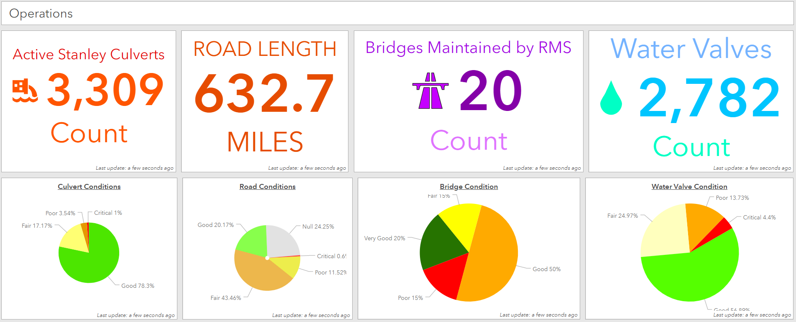

# Ryan Hildebrand's Portfolio

Welcome to my GitHub portfolio! Here you'll find a collection of my projects, skills, and experiences. I'm passionate about data analysis, GIS, remote sensing, and agriculture. Feel free to explore my repositories and reach out if you have any questions or collaboration opportunities.

## About Me

I am a skilled data analyst with a background in GIS, remote sensing, and agriculture. I have experience in project management, spatial data analysis, and business data analysis. I am always eager to learn new skills and take on challenges.

## Skills

- **Programming Languages:** Python, R, SQL, VBA
- **Remote Sensing:** Satellite imagery analysis, image classification, land use/land cover mapping, photogrammetry
- **Data Analysis and Visualization:** Power BI, Tableau, Excel
- **Data Engineering:** FME data pipelines, ETL processes
- **Project Management:** Task management, planning, execution
- **Software:** ArcGIS, QGIS, ESRI Location Platform, FME, Microsoft Office Suite, Monday.com, Git, SiteScan

## Experience

### GIS and Fiber Optics Specialist
**Valley Fiber**  
*Worked on GIS analysis and fiber optics projects, including spatial data management and network design.*

- Managed GIS data for fiber optic network projects.
- Developed tools and scripts for automating GIS tasks using Python and VBA.
- Built and maintained FME data pipelines for efficient data processing and integration.
- Coordinated with teams to ensure accurate and efficient data handling.

### GIS Tech
**Rural Municipality of Stanley**  
*Focused on land use planning, municipal infrastructure, and rural development projects.*

- Conducted spatial analysis and mapping for municipal planning and development.
- Assisted in the creation and maintenance of a comprehensive GIS database.
- Supported infrastructure projects with GIS-based data collection and analysis.
- Created interactive dashboards using Power BI for visualizing municipal data trends.
- Collaborated with municipal staff to ensure compliance with local regulations and standards.

### Agronomist / Farm Management Intern
**Agriculture and Agri-Food Canada (AAFC)**  
*Gained hands-on experience in farm management, crop monitoring, and agricultural data collection.*

- Assisted in field data collection and analysis.
- Supported farm management activities and planning.
- Collaborated with researchers to analyze agricultural trends and data, including remote sensing data for crop health monitoring.

## Projects

### [Fiber Management ETL Automation](https://github.com/yourusername/fiber-management-etl)
Project: Valley Fiber – CIB-Backed Manitoba Fibre Deployment

Name of Customer
Valley Fiber Ltd. / Canada Infrastructure Bank (CIB) partnership

Project Name
Manitoba Fibre Broadband Build (CIB Investment)

Year
2021–2024

Budget
Approximately CAD 328 million total project budget, including a CAD 164 million investment from CIB and matching private financing. 
cib-bic.ca
+1

Hours of Implementation
900

Global Description
A large-scale broadband infrastructure initiative to deliver high-speed, dedicated fiber-to-the-home connectivity to underserved rural communities across southern Manitoba. The project involves construction of thousands of kilometres of fibre-optic cabling, creation of new network infrastructure, and deployment of reliable broadband services capable of gigabit speeds, improving digital access for residents, businesses, and public services. 
cib-bic.ca
+1

Role and Personal Contribution
Acted as Senior GIS Specialist supporting network design, asset data modeling, geospatial workflow automation, and quality control processes throughout the build. Developed and implemented GIS tools and automation that enhanced data accuracy, streamlined engineering deliverables, and reduced manual errors. Led training and coordination for GIS team members to maintain high execution standards across OSP data and mapping deliverables.
### [Infrastructure and Asset Management Dashboard]
Name of Customer
Cal Trans

Project Name
FieldWatch Central Dataset and Workflow Integration

Year
2025

Budget
1.2M (enterprise-wide GIS modernization program including FieldWatch)

Hours of Implementation
320

Global Description
Designed and implemented FieldWatch, a unified GIS data framework supporting Transportation Management’s construction, inspection, and operational workflows. The solution standardized schemas, consolidated multiple legacy datasets, and enabled real-time integration with Survey123, custom dashboards, and Experience Builder applications. FieldWatch now serves as the authoritative backbone for field data collection, inspection visibility, and project tracking across the organization.

Role and Personal Contribution
Led the data model architecture, ArcGIS Enterprise service configuration, and automation workflows. Designed advanced Survey123 forms with conditional logic, dynamic content controls, and schema-driven behavior to streamline field reporting. Developed custom dashboards for operational monitoring and executive oversight, and built Experience Builder applications to deliver interactive, user-focused interfaces for project managers and field teams. Ensured all applications aligned with the central dataset structure, optimized performance across dev/editing/production environments, and implemented governance practices for long-term scalability.

### [Infrastructure and Asset Management Dashboard](https://github.com/yourusername/infrastructure-dashboard)
*Aggregated data for infrastructure and asset management planning, focusing on fiber optics and municipal projects.*

- **Technologies:** Power BI, SQL, Tableau, ArcGIS Dashboards
- **Summary:** Developed a solution for aggregating data from various databases to support infrastructure and asset management planning for fiber optic networks and municipal projects in the Rural Municipality of Stanley. The process involved extracting and consolidating data from multiple sources, ensuring data consistency and accuracy, and creating interactive dashboards using Power BI and ArcGIS Dashboards. These dashboards provided valuable insights into asset management and infrastructure planning, enhancing decision-making and operational efficiency.

### [Remote Sensing for Drainage and Culvert Planning](https://github.com/yourusername/remote-sensing-drainage-culvert)
*Advanced remote sensing analysis for drainage planning and culvert asset management.*

- **Technologies:** Python, ArcGIS, Remote Sensing Software, DJI Mavic Drones, SiteScan Photogrammetry Software
- **Summary:** Applied advanced remote sensing techniques, including multispectral and LiDAR analysis, using DJI Mavic drones and SiteScan photogrammetry software to determine optimal drainage plans and extract culvert assets. The project involved using digital elevation models (DEMs) and high-resolution multispectral imagery to analyze hydrological patterns, perform terrain analysis, and conduct culvert sizing and placement analysis. This data was integrated into GIS for creating detailed drainage models and assessing culvert infrastructure, aiding in effective water management and infrastructure planning.

## Education

**Bachelor of Environmental Studies**  
*Focus in Land Management, Minor in Soil Science*  
University of Manitoba, 2020  

## Certifications

- **Drone License Certification** - Canada Small Drones
- **Esri Python for Everyone Certification** - Esri
- **Esri ArcGIS Pro Essentials Certification** - Esri

## Contact

- **Email:** [ryanhildebrand@hotmail.ca](mailto:ryanhildebrand@hotmail.ca)
- **LinkedIn:** [Ryan Hildebrand](https://www.linkedin.com/in/ryan-hildebrand-419b97255/)

---

Feel free to reach out if you'd like to collaborate or if you have any questions about my work. I'm always open to new opportunities and challenges!
